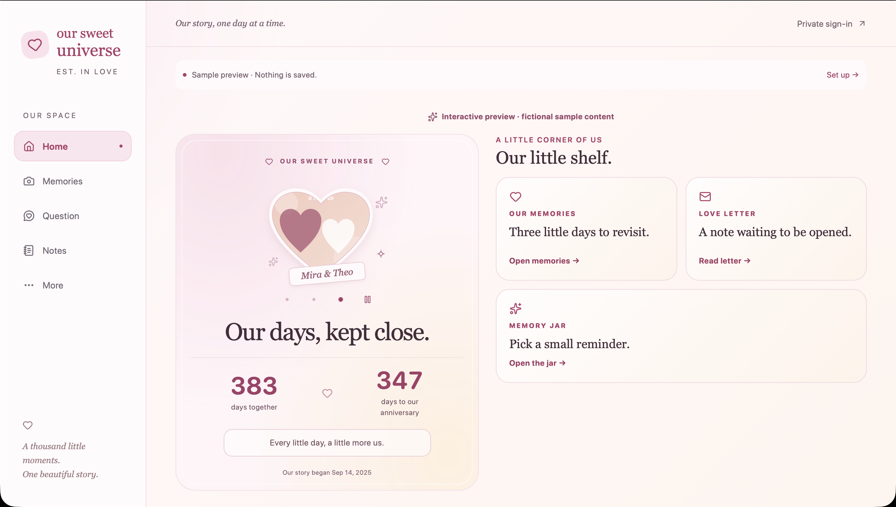

# Our Sweet Universe

A private couple app, built incrementally as a learning project.

## Preview



Run the app and open `/demo` to explore the interactive fictional preview. It uses sample content only and never reads or saves private couple data.

## Design approach

Our Sweet Universe is a mobile-first, responsive web app. The primary experience is designed for two people using their phones, while tablet and desktop layouts provide more space for shared memories and navigation.

**Current build:** a private, authenticated shared space for two people. It includes shared Home customization, heart-photo delivery, memories with media, daily questions with private answers and history, Love Letters, Little Jar notes, partner presence, and an expiring partner-invite flow. `/demo` remains fictional and separate from private data. Production operations such as backup/restore workflows and broader end-to-end deployment hardening remain future work.

## Run locally

Use Node.js 22.13+ (tested on Node 24) and pnpm 10.26.2.

```sh
pnpm install --frozen-lockfile
pnpm run dev
```

Open http://localhost:3000/demo. No credentials are needed for the fictional preview. It never writes to localStorage, a database, or Cloudinary. `/space` redirects to login when the app is unconfigured. Do not enter real private content into the demo.

```sh
pnpm run typecheck
pnpm run lint
pnpm test
pnpm run build
```

## Read the project in this order

1. `src/app/layout.tsx` — common HTML shell and metadata.
2. `src/app/demo/[[...section]]/page.tsx` — Next.js routes to all seven preview screens.
3. `src/components/shell.tsx` — navigation and responsive layout.
4. `src/components/preview.tsx` — sample UI interactions; separate from private storage.
5. `src/lib/db/schema.ts` — Drizzle tables, foreign keys and indexes.
6. `src/lib/auth.ts` — Better Auth with Drizzle and closed public registration.
7. `src/lib/authorization.ts` — session-to-couple authorization boundary.
8. `src/lib/memories.ts` — SQL-shaped queries with couple filtering.

Read [the architecture](docs/ARCHITECTURE.md), [Step 1 walkthrough](docs/STEP-1.md), and [security and next steps](docs/SECURITY.md).

## Environment setup

Copy `.env.example` to `.env.local`. Keep real values out of Git and chat. `DATABASE_URL` is a Neon PostgreSQL connection string. `BETTER_AUTH_SECRET` must contain at least 32 cryptographically random characters; `BETTER_AUTH_URL` is the exact app origin. Cloudinary settings stay server-side and are not needed for Step 1.

Password reset and email verification use Resend. In production, verify a dedicated sending subdomain such as `notify.yourdomain.com` in Resend, add its SPF and DKIM DNS records, then set `RESEND_API_KEY` and `EMAIL_FROM="Our Sweet Universe <hello@notify.yourdomain.com>"`. Set `BETTER_AUTH_URL` to the public app URL, such as `https://app.yourdomain.com`. Every new partner account must confirm its email before it can sign in.

The optional 11:30 unanswered-question reminder uses a small Cloudflare Worker as a scheduler while Vercel continues to host the app, database logic, and Resend integration. See [the Worker setup](workers/question-reminder/README.md). It sends one privacy-safe reminder only to verified members who have not answered yesterday's question.

```sh
pnpm run db:generate
# Review generated SQL before applying to your development Neon branch.
pnpm run db:migrate
```

The included migration has been applied to this checkout’s configured Neon database. Fresh databases still need `pnpm run db:migrate`. Do not run migrations against production as part of casual UI testing. Public signup is deliberately disabled; run `pnpm setup:owner` locally to create the first account and couple membership. Follow [Step 2](docs/STEP-2.md) for the prompts and login check. There is no signup bypass hidden in the demo.

See [Step 3 walkthrough](docs/STEP-3.md) for the memory flow and verification limits.

## Current capabilities

- [x] Closed registration, sign-in, email verification, password reset, owner setup, and couple-scoped authorization.
- [x] Responsive shared Home with customizable widgets, heart-photo carousel, anniversary calculations, and partner presence.
- [x] Private memories, milestones, media attachments, gallery, editing, deletion, and pagination.
- [x] Daily questions with private answers, reveal-after-both-answering, history, reminder support, and a pause flow.
- [x] Persistent Love Letters and Little Jar notes, including read/open tracking.
- [x] Expiring, single-use partner invite creation and acceptance.
- [ ] Backup/restore procedures, broader live end-to-end checks, and operational deployment hardening.

## Stack

Next.js App Router + React + TypeScript; Tailwind CSS; Better Auth; Drizzle ORM; Neon PostgreSQL; Cloudinary SDK. Exact installed versions are recorded in `pnpm-lock.yaml`.

References: [Next.js installation](https://nextjs.org/docs/app/getting-started/installation), [Better Auth Drizzle adapter](https://better-auth.com/docs/adapters/drizzle), [Drizzle Neon guide](https://orm.drizzle.team/docs/connect-neon), [Cloudinary access control](https://cloudinary.com/documentation/control_access_to_media).

### Restricted macOS development environments

If the development watcher reports `EMFILE`, run `WATCHPACK_POLLING=true pnpm run dev`. The preview in this session was checked with polling enabled. This avoids changing system-wide file limits.
